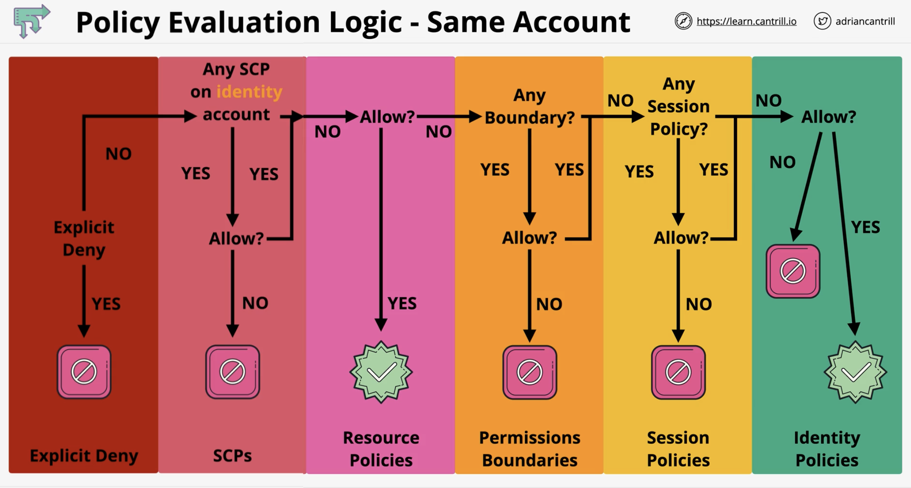

## Policy Interpretation Deep Dive

**Steps in Interpreting Policies**

1. Identify the number of statements
2. Identify at a high level what each statement actually does or effect of each statement
3. Check the overlaps of each statement

* Effect Hierarchy: Explicit Deny > Explicit Allow > Implicit Deny

## Policy Evaluation Logic

### Components involved in evaluating policies

1. Organization Service Control Policies (SCP)
	\- impact what identities inside Organization Member accounts can do.

2. Resource Policies
	\- policies attached to resources which allows or denies specified principals.

3. IAM Identity Boundaries
4. Session Policies
5. Identity Policies

### Hierarchy of Evaluation for Same Account

1. Explicit Deny
2. Service Control Policies
3. Resource Policies
4. Permissions Boundaries
5. Session Policies
6. Identity Policies

* AWS first checks the whole list for Explicit Denies.

### Hierarchy of Evaluation for Different Accounts (Multi-Account or Cross Account Access)

* A successful access requires an applicable allow from both Account A and Account B.

## AWS CloudHSM

* CloudHSM is essentially a true “Single Tenant” Hardware Security Module (HSM).
* Runs in 1 AZ only.
* AWS provisioned service but fully customer managed.
* Fully FIPS 140-2 Level 3 Compliant (KMS is L2 Overall).
* Accessible via Industry Standard APIs (e.g. PKCS#11, Java Cryptography Extensions (JCE), Microsoft CryptoNG (CNG) Libraries).
* KMS Can use CloudHSM as a Custom Key Store, CloudHSM integration with KMS.

**CloudHSM Architecture**

* CloudHSMs are not deployed inside a VPC that you control, but instead AWS Managed CloudHSM VPC.
* HSMs by Default is not an HA device.
* Once HSM devices are configured as a cluster, they are able to replicate any keys, policies or other configurations in that cluster.
* Injected via ENIs in Customer VPCs.
* A client needs to be installed on EC2 instances to utilize the CloudHSM devices.
* AWS have no access to secure area where key material is held.

**Use Case**

* No Native AWS Integration between CloudHSM and any AWS products.
* Can be used to offload SSL or TLS processing from web servers.
* Enable Transparent Data Encryption (TDE) for Oracle Databases or MS SQL.
* Protect the private keys for an issuing Certificate Authority.
